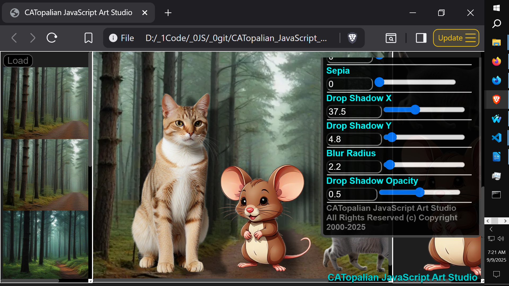
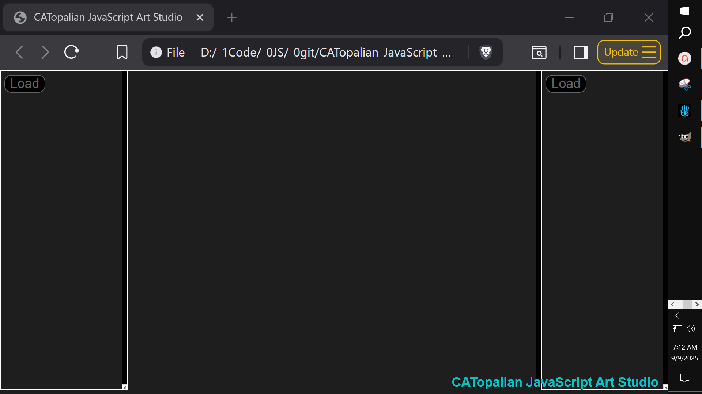
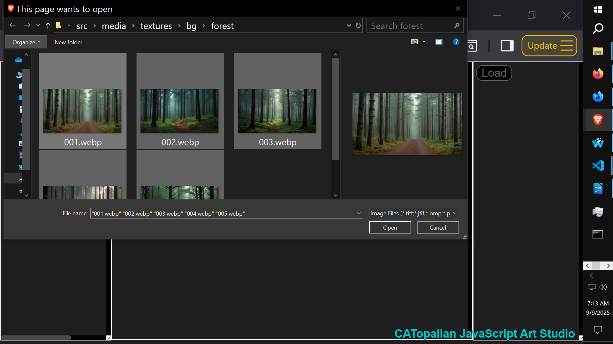
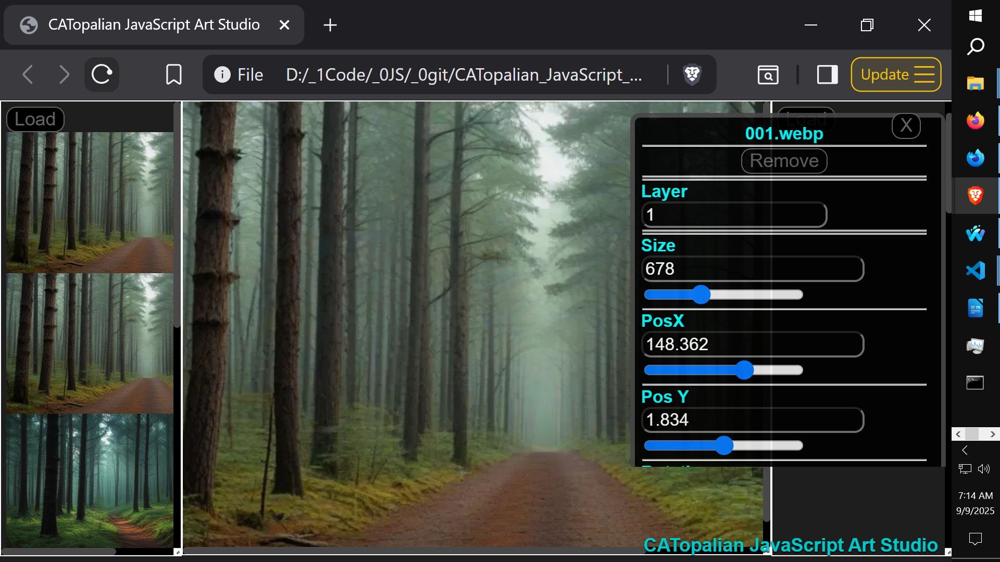
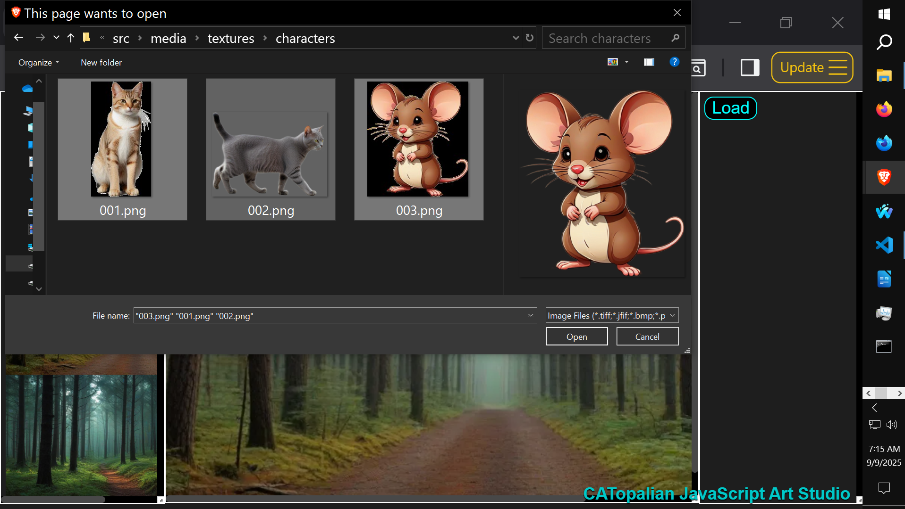
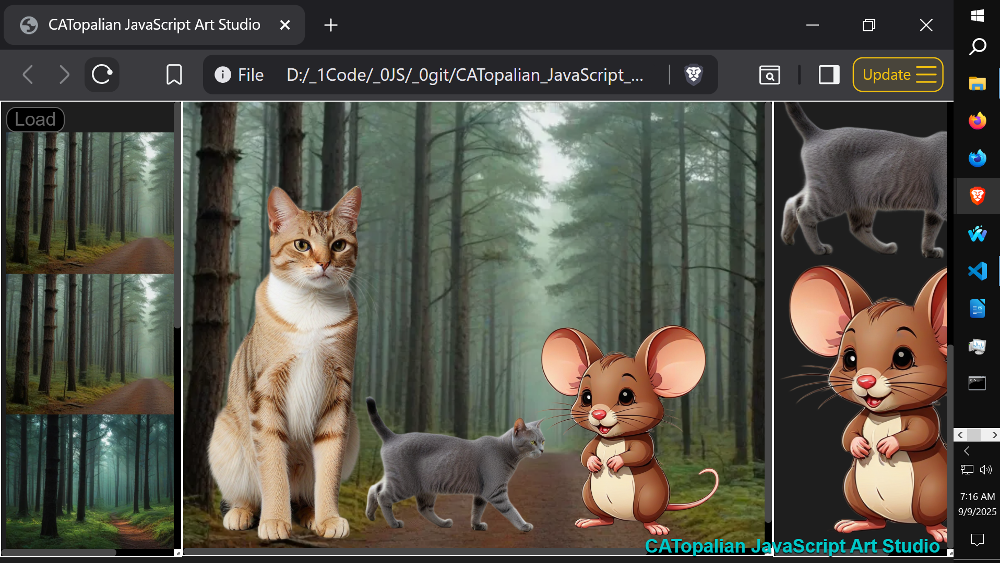
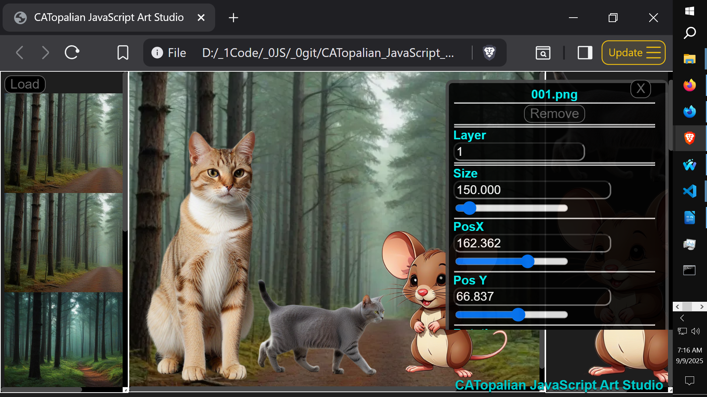
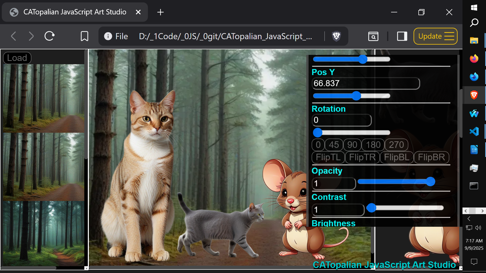
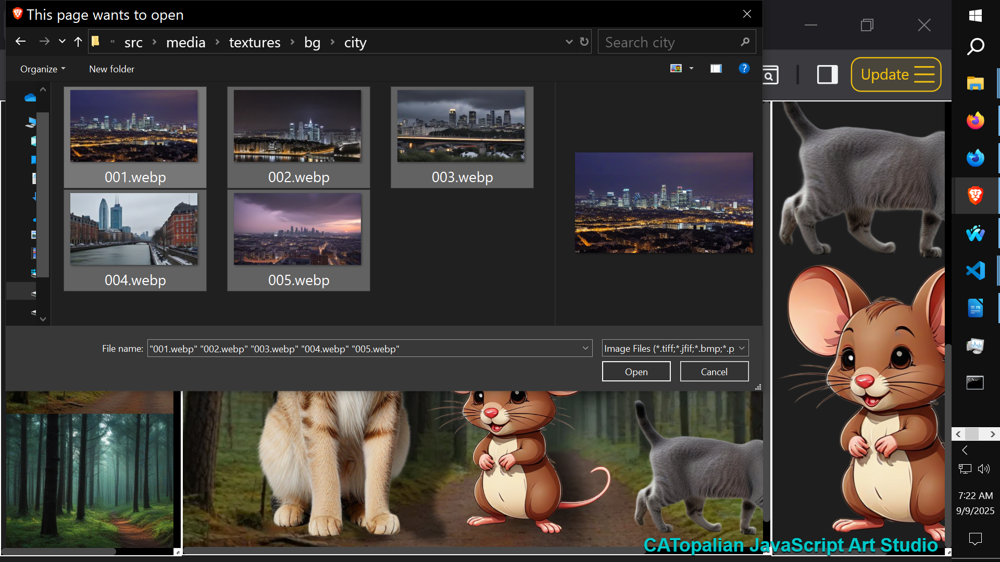
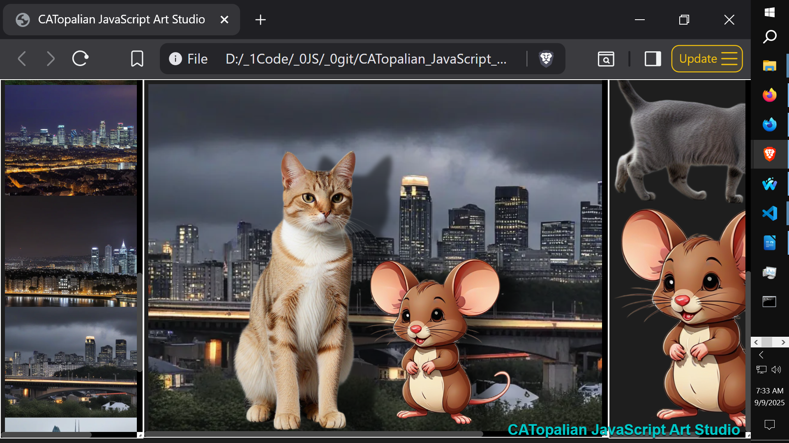

# CATopalian JavaScript Art Studio
A JavaScript Art Studio where users can load, layer, and transform images on a stage. Features file handling, filters, dynamic image manipulation and much more.

---

  

Video: https://www.youtube.com/watch?v=uS9HeW1YxZg

Use App: https://christopherandrewtopalian.github.io/CATopalian_JavaScript_Art_Studio/CATopalian_JavaScript_Art_Studio.html  

---

The **CATopalian JavaScript Art Studio** is an interactive web application built entirely with JavaScript. It allows you to **load, arrange, and transform multiple images** to create unique digital compositions.

This project is both a **creative tool** and a **learning resource**:

* Creative users can design scenes by combining backgrounds, characters, and assets.
* Developers can study the JavaScript code to learn about **file input handling, dynamic DOM manipulation, CSS filters, and image transformations**.

---

## ✨ Features

* **Two-column image loaders**

  * Left and right panels each have a dedicated load button.
  * Load multiple images into scrollable columns.
  * Click on any image in a column to place it onto the central stage.

* **Central stage canvas (div-based)**

  * Images from the columns can be added directly to the stage.
  * Multiple images can be arranged, layered, and manipulated.

* **Image controls**

  * Positioning: adjust `posX`, `posY` for exact placement.
  * Scaling: resize images to fit the scene.
  * Rotation: free rotation plus quick flip options (horizontal, vertical).

* **Visual filters & effects**

  * Opacity
  * Contrast
  * Brightness
  * Hue
  * Saturation
  * Grayscale
  * Blur
  * Invert
  * Sepia

* **Advanced effects**

  * Drop shadow: control X offset, Y offset, blur radius, and opacity.

---

## 🎨 Design

This project shows:

* How to handle **multiple file inputs** in JavaScript.
* How to **dynamically create and manage DOM elements** for images.
* How to apply **CSS filters and transforms** with JavaScript controls.
* How to build an **interactive, scrollable, and layered art environment**.

---  

//----//

// Dedicated to God the Father  
// All Rights Reserved Christopher Andrew Topalian Copyright 2000-2026  
// https://github.com/ChristopherTopalian  
// https://github.com/ChristopherAndrewTopalian  
// https://sites.google.com/view/CollegeOfScripting

